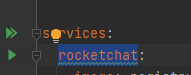

# docker-nginxreverse
 
## Installation

1. Make sure you've installed Docker including `docker-compose` support.

2. Create and start up containers using `docker-compose`:

    ```
    docker-compose up -d
    ```
3. Test that you can connect from this instance to others on it's network

Find your host name in the docker-compose.yml 

      
 
Find the port from the documentation of the app (rocketchat here) which is 3000
```bash
      #find your instance
      sudo docker ps | grep nginx
      #shell into it 
      sudo docker exec -it -u root NAME_FROM_DOCKER_PS /bin/bash
      #run curl on the host name and port to make sure this docker can see it 
      curl http://rocketchat:3000 
      #---- curl output should say got index.html ----
      exit
```
   
## Requirements / Dependencies

* Docker

## Version

1.0.0

## License

[MIT](https://opensource.org/license/mit/)
